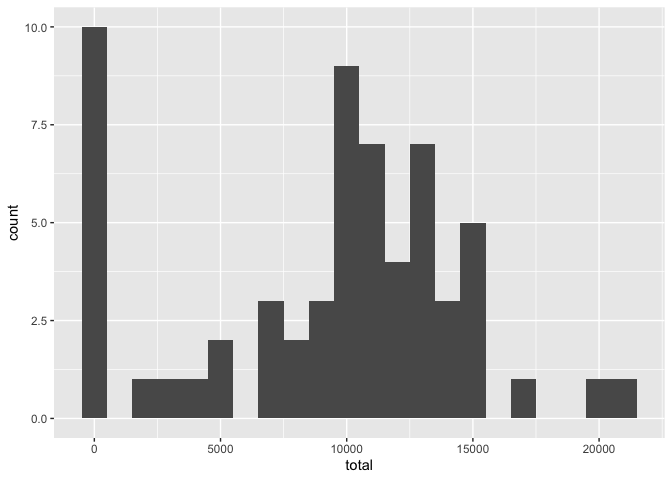
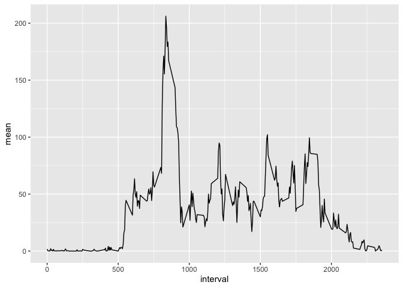
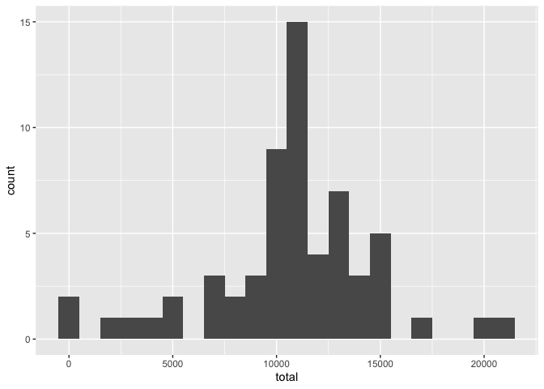
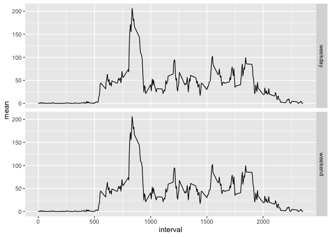

## Loading and preprocessing the data


```r
# set the working directory
setwd("/Users/dncgst/GitHub/RepData_PeerAssessment1/")

# unzip the raw data
unzip(zipfile = "activity.zip")

# read the raw data
data <- read.csv("activity.csv")

# pre-processing the data (remove NAs, date as Date)
#data <- data[complete.cases(data$steps),]
data$date <- as.Date(data$date, format = "%Y-%m-%d")
```

## What is mean total number of steps taken per day?


```r
# split-apply-combine method
#s <- split(data, data$date)
#sapply(s, function(x) mean(x$steps))

# tapply method
#tapply(data$steps, data$date, mean)

# aggregate method
#aggregate(steps ~ date, data, mean)

# dplyr method
library(dplyr)
```

```
## 
## Attaching package: 'dplyr'
```

```
## The following objects are masked from 'package:stats':
## 
##     filter, lag
```

```
## The following objects are masked from 'package:base':
## 
##     intersect, setdiff, setequal, union
```

```r
data %>% group_by(date) %>% summarise(total = sum(steps, na.rm = TRUE))
```

```
## # A tibble: 61 x 2
##    date       total
##  * <date>     <int>
##  1 2012-10-01     0
##  2 2012-10-02   126
##  3 2012-10-03 11352
##  4 2012-10-04 12116
##  5 2012-10-05 13294
##  6 2012-10-06 15420
##  7 2012-10-07 11015
##  8 2012-10-08     0
##  9 2012-10-09 12811
## 10 2012-10-10  9900
## # … with 51 more rows
```

Histogram of the total number of steps taken each day


```r
# histogram of the total number of steps taken each day

# ggplot
library(ggplot2)

data %>% group_by(date) %>% summarise(total = sum(steps, na.rm = TRUE)) %>% ggplot() + geom_histogram(aes(total), binwidth = 1000)
```

<!-- -->

Mean and median of the total number of steps taken per day


```r
# calculate the mean and median of the total number of steps taken per day
foo <- data %>% group_by(date) %>% summarise(total = sum(steps, na.rm = TRUE))
mean(foo$total, na.rm = TRUE)
```

```
## [1] 9354.23
```

```r
median(foo$total, na.rm = TRUE)
```

```
## [1] 10395
```

## What is the average daily activity pattern?


```r
# Make a time series plot (i.e. type = "l" type = "l") of the 5-minute interval (x-axis) and the average number of steps taken, averaged across all days (y-axis)

data %>% group_by(interval) %>% summarise(mean = mean(steps, na.rm = TRUE), total = sum(steps, na.rm = TRUE)) %>% ggplot(aes(x=interval, y=mean)) + geom_line()
```

<!-- -->

Which 5-minute interval, on average across all the days in the dataset, contains the maximum number of steps?


```r
foo %>% dplyr::arrange(desc(total)) %>% slice_head()
```

```
## # A tibble: 1 x 2
##   date       total
##   <date>     <int>
## 1 2012-11-23 21194
```

## Imputing missing values

Calculate and report the total number of missing values in the dataset
(i.e. the total number of rows with NAs)


```r
sum(!complete.cases(data))
```

```
## [1] 2304
```

Devise a strategy for filling in all of the missing values in the dataset. The strategy does not need to be sophisticated. For example, you could use the mean/median for that day, or the mean for that 5-minute interval, etc.


```r
# group by intervals and impute mean values to NAs
foo <- data %>% group_by(interval) %>% mutate(mean = mean(steps, na.rm = TRUE)) %>% filter(is.na(steps)) %>% mutate(steps = mean) %>% ungroup() %>% select(-mean)

# if_else condition...
#data %>% group_by(interval) %>% mutate(steps2 = 
                                         #if_else(is.na(steps),
                                                 #mean(steps, na.rm = TRUE),
                                                 #steps)
                                       #)
```

Create a new dataset that is equal to the original dataset but with the missing data filled in.


```r
data2 <- data %>% filter(!is.na(steps)) %>% bind_rows(foo)
```

Make a histogram of the total number of steps taken each day.


```r
# histogram of the total number of steps taken each day

data2 %>% group_by(date) %>% summarise(total = sum(steps, na.rm = TRUE)) %>% ggplot() + geom_histogram(aes(total), binwidth=1000)
```

<!-- -->

Calculate and report the mean and median total number of steps taken per day. 


```r
foo <- data2 %>% group_by(date) %>% summarise(total = sum(steps, na.rm = TRUE))
mean(foo$total)
```

```
## [1] 10766.19
```

```r
median(foo$total)
```

```
## [1] 10766.19
```

Do these values differ from the estimates from the first part of the assignment? What is the impact of imputing missing data on the estimates of the total daily number of steps?

The mean and median values are now bigger and similar. The distribution resample more a normal distribution.

## Are there differences in activity patterns between weekdays and weekends?

Create a new factor variable in the dataset with two levels – “weekday” and “weekend” indicating whether a given date is a weekday or weekend day.


```r
data2 <- data2 %>% mutate(weekday = weekdays(date)) %>% mutate(weekday = if_else(condition = weekday %in% c("Saturday","Sunday"), true = "weekend", false = "weekday"))
```

Make a panel plot containing a time series plot (i.e. type = "l") of the 5-minute interval (x-axis) and the average number of steps taken, averaged across all weekday days or weekend days (y-axis).


```r
# ggplot2
data2 %>% group_by(interval) %>% mutate(mean = mean(steps, na.rm = TRUE)) %>% ungroup() %>% ggplot(aes(x=interval, y=mean)) + geom_line() + facet_grid(rows = vars(weekday))
```

<!-- -->

